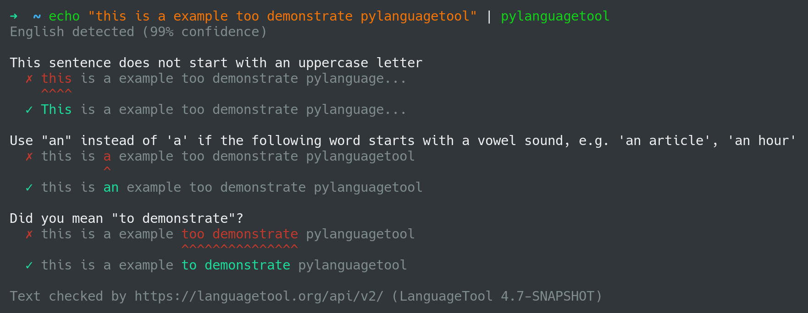

==============
pyLanguagetool
==============
|travis| |license| |latestrelease| |pypi_versions|

A python library and CLI for the LanguageTool_ `JSON API`_.

LanguageTool_ is an open source spellchecking platform. It supports a large
variety of languages and has advanced grammar support.

.. include:: ../README.rst
    :start-after: start-of-homepage-text

All Contents
============

.. toctree::
    :maxdepth: 2
    :caption: Contents:
    :glob:

    *
